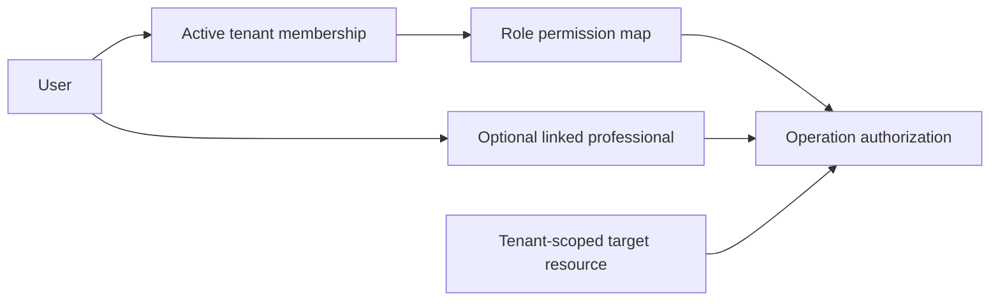
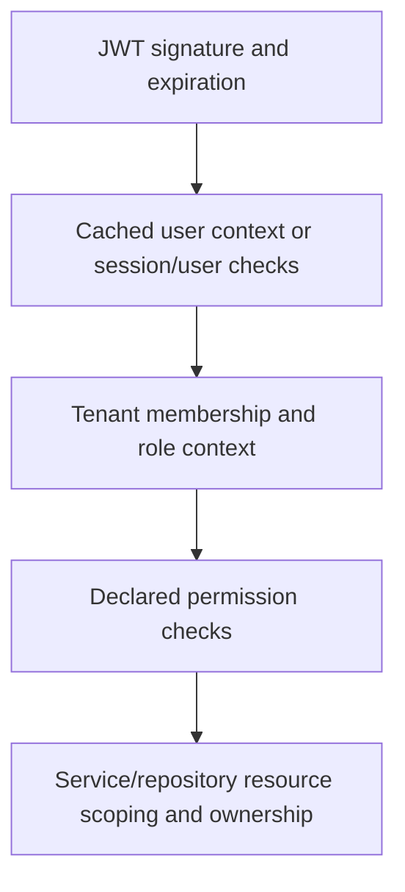

# Access control

## Purpose and boundaries

Use this guide when changing authentication, tenant access, permissions or resource ownership. It explains the combined contract across Auth, Sessions, Memberships, Team/Invitations, Professionals and resource services. It also distinguishes public appointment tokens and notification WebSocket authentication from the HTTP guard pipeline.

This is not an exhaustive security audit, OAuth/setup guide or permission catalog. Read [backend guidance](../AGENTS.md) for operational constraints and [scheduling and booking](scheduling-and-booking.md) for appointment lifecycle behavior.

Documentation provides context; relevant code and tests remain the evidence of actual behavior. Report conflicts, determine behavior from implementation/tests and update this guide when a task changes documented behavior. **Invariant** below means an enforced constraint within the stated boundary; **Current behavior** records implementation without endorsing permanent policy; **Uncertainty** identifies intent or guarantees not established by the repository.

## Ownership and core relationships

| Owner | Responsibility |
| --- | --- |
| Auth / Sessions | Login, cookie tokens, refresh, session lifecycle and user token-version invalidation |
| Memberships | User–tenant relationship, role and active access |
| Team / Invitations | Coordinate membership changes and optional professional/user linking |
| Professionals | Bookable professional identity, optionally linked to a user |
| Resource services / repositories | Tenant-scoped resources, related-record validation and operation-specific ownership |

A membership grants tenant access; a professional link identifies a bookable resource associated with a user. Neither substitutes for the other. A professional can exist without a user, and a member need not be a professional. STAFF membership alone does not establish a professional link.

**Current behavior:** users can have multiple memberships, but the schema's unique `Professional.userId` permits at most one linked professional globally, not one per tenant. Do not assume multi-tenant professional identity from multi-tenant membership support.

## Enforced invariants

- **Explicit tenant resolution:** TenantGuard requires active membership in the selected tenant. ID takes precedence over slug; an invalid supplied ID does not fall back to slug.
- **Declared permissions:** PermissionsGuard requires every permission declared by the effective handler/class metadata. Missing tenant permissions fail when permissions are declared.
- **Tenant-scoped appointment mutations:** authenticated appointment lookups and updates include the tenant ID in repository predicates.
- **Authenticated reschedule ownership:** without `APPOINTMENT_RESCHEDULE_OTHERS`, the service resolves the user's professional in the tenant and requires it to match the appointment.
- **Invitation acceptance:** explicit acceptance checks the current user's email against the recipient; membership creation and optional professional linking share the acceptance transaction.

These statements describe specific enforcement points. They do not prove that all relationship writes or all operations enforce equivalent constraints.

## Main flows and current behavior

### Authenticated HTTP requests

Global guards run in this order:

| Layer | Establishes | Leaves to other layers |
| --- | --- | --- |
| JWT verification | Validates access-cookie token signature and expiration | Session freshness, membership and resource access |
| JwtAuthGuard | On cache miss: user existence, unrevoked/unexpired session and matching user token version | Tenant access; immediate revocation on cached requests |
| TenantGuard | Active membership and role-derived permission context for the resolved tenant | Ownership of resource IDs and related records |
| PermissionsGuard | All declared permissions are present | Resource ownership; undeclared permissions are not inferred |
| Services/repositories | Path-specific scoping and relationship checks | No universal authorization guarantee across all paths |

**Current behavior:** JwtAuthGuard caches by session JTI for five minutes. Cache hits still verify the JWT but skip database session/token-version validation and reuse the cached user/JTI for that session. Different sessions for the same user retain their own JTI context. Immediate revocation and per-session revalidation on every request are not established guarantees.

Login creates or reuses a user/device session and issues access/refresh cookies. Refresh checks the stored session and token version and extends the session. Logout-all and password reset revoke sessions and increment token version, but do not invalidate the guard's in-memory cache. Session upsert reactivates an existing user/device session without replacing its JTI. Do not describe every login/refresh as token-identity rotation.

### Tenant selection exceptions

| Decorator / mode | Authentication | Tenant behavior |
| --- | --- | --- |
| Normal authenticated route | Required | Headers required; ID before slug; active membership required |
| `OptionalTenant` | Required | Without headers, first active membership if present; otherwise no tenant context. With headers, normal membership validation |
| `SkipTenant` | Required | No membership/context resolution by TenantGuard |
| `Public` | JWT guard bypassed | Tenant guard bypassed |

PermissionsGuard acts independently of these modes. Public/skip routes with declared permissions still need the corresponding context; the decorator does not bypass permission metadata. Public requests do not receive an authenticated user merely because a cookie is present.

**Current behavior:** optional fallback has no explicit ordering. Active tenant is request-selected or fallback-derived, not persistent authorization state. Services on skip-tenant paths must establish their own required access; onboarding, for example, resolves ownership through its own membership queries.

### Public resources and management tokens

The Public facade forwards resource IDs to services. Availability checks that the requested service and professional are eligible in the supplied tenant. Public appointment management resolves the appointment by its unique management token instead of membership.

The token is a capability: possession permits the public lookup and the mutations allowed by that appointment's status/count rules. The inspected paths do not add customer authentication, token expiration or rotation. Do not interpret knowledge of an appointment ID as equivalent authority.

Authenticated appointment responses map `manageToken` to `confirmationCode`. Changes to that field affect capability disclosure as well as response shape. Public lookup also returns customer details; preserve awareness of what token possession exposes.

## Authorization and tenant isolation

Role permissions are explicit maps, not inheritance. OWNER has all catalog permissions. ADMIN has management and own/others appointment permissions, including tenant settings updates, but no billing or tenant-deletion permission. Existing team hierarchy and owner/self protections remain enforced in services. STAFF has customer read/create, service read, and own appointment read/create/update/reschedule/cancel. STAFF cannot manage the professional directory, schedules, services, existing customers, team or billing. Account profile access remains separate. Consult the constants for the authoritative catalog.

A guard-selected tenant must reach resource predicates. Related-record IDs also need same-tenant validation: independent foreign keys prove existence, not that two records belong to the same tenant. Self-service professional routes resolve by both tenant and user; administrative relationship writes require separate scrutiny.

Authenticated appointment listing forces the tenant-linked professional ID for callers without `APPOINTMENT_READ_OTHERS`, overriding supplied professional filters for rows and counts. ID lookup checks the appointment's linked user. Creation without `APPOINTMENT_CREATE_OTHERS` requires the user's professional in that tenant to match the requested professional. Missing professional links fail closed. Rescheduling and cancellation retain their own/others ownership checks, including before returning an already-cancelled record. STAFF can manage their own appointments; OWNER/ADMIN can manage others. Cancellation permissions do not grant deletion access. Appointment completion/update and deletion remain unfinished endpoint features; permissions do not implement those operations.

## Dependencies and side effects

Invitation acceptance can create membership and link a professional. Professional deletion through either authenticated delete route coordinates soft deletion, outstanding invitation revocation, and removal of the linked membership row for the selected tenant in one transaction. OWNER-linked and self-linked professionals are protected; only OWNER may delete an ADMIN-linked professional. User accounts, other tenant memberships, and appointment history remain intact. These lifecycle paths affect subsequent tenant access independently of JWT validity.

Notification WebSocket connections validate the access JWT directly and join a user room. They do not run the HTTP session, membership or permission guards. Do not transfer HTTP revocation/tenant guarantees to that transport.

## Edge cases, inconsistencies and uncertainties

| Finding | Evidence / limit |
| --- | --- |
| Session freshness differs from token validity | Session-keyed JWT guard cache delays stored-session/token-version checks; cache-miss code also does not explicitly compare session user ID to token subject |
| Selected tenant context | `/auth/me` passes the guard-selected tenant ID; invitation acceptance refreshes using the target ID |
| Roles metadata is not enforcement | `Roles` exists, but no consumer of its metadata was located in the inspected guard pipeline |
| Team management hierarchy | Member and invitation management reload the actor’s active membership under the tenant row lock. OWNER manages ADMIN/STAFF; ADMIN manages STAFF and assigns only STAFF. Owner and self memberships are protected. |
| Resource tenant can differ from guard tenant | Availability slots/overview/validate use query tenant IDs; appointment availability uses guard context |
| Related-resource isolation is incomplete | Administrative working-hours writes, exception professional links and service-assignment writes lack same-tenant validation in the inspected paths |
| Logout session scope | Logout reads the authenticated user through `CurrentUser`, revokes that session JTI and clears access/refresh cookies after revocation succeeds. `SkipTenant` permits logout without active tenant membership; logout-all retains normal tenant requirements |
| Invitation entry before membership | Validation is public/token-scoped, acceptance is authenticated with `SkipTenant`, and create/revoke extract the tenant ID |
| Professional/profile context needs verification | The profile repository accepts tenant ID but fetches the user's globally linked professional without using it |

These observations are not approved policy or runtime exploit demonstrations. Desired role hierarchy, owner lifecycle, session freshness and public capability restrictions require explicit decisions in future work.

## Implementation entry points and test coverage

| Question | Verify |
| --- | --- |
| Guard order and runtime entry | [App module](../src/app.module.ts), [main](../src/main.ts) |
| Identity/session guarantees | [JWT guard](../src/common/security/guards/jwt-auth.guard.ts), [JWT service](../src/auth/infrastructure/jwt/jwt.service.ts), [auth service](../src/auth/services/auth.service.ts), [sessions repository](../src/auth/sessions/sessions.repository.ts) |
| Tenant and permission guarantees | [TenantGuard](../src/common/security/guards/tenant.guard.ts), [PermissionsGuard](../src/common/security/guards/permissions.guard.ts), [decorators](../src/common/security/decorators), [role permissions](../src/common/security/constants/role-permissions.constants.ts) |
| Membership/professional lifecycle | [Memberships](../src/modules/memberships), [Team](../src/modules/team), [Invitations](../src/modules/invitations), [Professionals](../src/modules/professionals) |
| User-context discrepancies | [Auth controller](../src/auth/auth.controller.ts), [user mapper](../src/modules/users/mappers/user-mapper.ts), [user repository](../src/modules/users/users.repository.ts) |
| Resource and public capability access | [Appointments](../src/modules/appointments), [Public facade](../src/modules/public), [Availability controller](../src/modules/availability/availability.controller.ts) |
| Alternate transport | [Notification WebSocket](../src/modules/notifications/infraestructure/gateways/notifications.ws.gateway.ts) |
| Authored data relationships | [Prisma schema](../prisma/schema.prisma), [migrations](../prisma/migrations) |

The located unit suites cover schedule formatting and appointment exclusion, not authorization/security guarantees. Treat these claims as implementation-derived unless a relevant test is added and verified.

Generated Prisma variants such as `client 2.ts` are not independent domain sources. Application imports use unsuffixed paths; the authored model source is the schema, with migrations providing history and code/tests providing behavior. Generated duplicates may still affect tooling; do not infer their exclusion from compilation or clean them up as part of domain work. Deployed database state has not been verified.

## When to update this document

Update when changing token/session validation or caching, guard/decorator behavior, tenant selection, role maps, membership/invitation lifecycle, professional/user relationships, resource ownership, management-token disclosure or alternate-transport authentication. Recheck the affected flow end to end and distinguish newly enforced guarantees from unresolved intent. Keep procedures and operational restrictions in AGENTS.md/skills.

The authenticated session's `activeTenant.timeZone` comes from the selected membership tenant's `settings.timeZone`. It is null when settings are absent; no display timezone is substituted. Dashboard scheduling reads this field from the auth store.

## Owner profile during onboarding

The [onboarding flow](onboarding.md) links a professional directly to its owner at confirmation when requested, without changing the OWNER membership. Tenant and owner row locks serialize confirmation with edits and profile linking. Selected services are verified in the owned tenant; existing profiles in another tenant are never reassigned.

## Creating a professional with optional access

[Professional creation](professional-creation.md) documents `POST /api/team/professionals`: OWNER/ADMIN via `PROFESSIONAL_CREATE`, required normalized contact fields, active same-tenant service validation, and an optional pending STAFF invitation. Creation and assignments roll back together on invitation conflicts. The creation event is published after commit; delivery uses the stored recipient email and does not require a user. Creating a pending invitation does not create membership or link a user. Creation and editing share contact/service validation. The professional editor manages access transactionally without changing account profile or membership role. Invitation signup/login/verification and Google context/consumption are implemented; see the linked guide for restrictions, lock ordering and verification limits.

### Professional booking status

Authenticated `PATCH /professionals/:id/status` requires `PROFESSIONAL_UPDATE` and a boolean `isActive`. It updates only an undeleted professional in the selected tenant, returning 404 otherwise. Explicit status assignment is idempotent. Owners/admins may update their own booking status; this does not change account login, memberships, service assignments or existing appointments. Public professional listings and availability validation continue to require active professionals. The dashboard confirmation guards tenant changes and refreshes professional lists/details, service selectors and availability after success.

## Team integration contract

`GET /api/team` remains OWNER/ADMIN-only via `TEAM_READ`. It lists all selected-tenant memberships, including inactive records, with membership `id`, `userId`, role, explicit `isActive`, and user name/email/avatar. Optional professional metadata is emitted only for a profile in that tenant. A professional without membership does not appear. Unaccepted, unrevoked invitations remain listed after expiry with derived `PENDING`/`EXPIRED` status and ISO `expiresAt`. Typed management mappers omit tokens.

`PATCH /api/team/members/:id` accepts ADMIN/STAFF `role`, boolean `isActive`, or both, requiring at least one field. `DELETE` remains a compatibility disable action. Both operate only on membership; booking availability, professional activity, assignments and appointments are unchanged. TenantGuard rejects inactive memberships on later protected HTTP requests.

Team invitation creation, role edits, resend and soft cancellation, plus alternate `POST /api/invitations` and `DELETE /api/invitations/:id`, enforce the same hierarchy in services using the actor's current database membership after the tenant lock. Managed IDs are UUID-validated and tenant-scoped. Missing managed targets return 404, forbidden actions 403 and state conflicts 409. Creation names are optional for compatibility with professional callers. Emails are normalized; existing memberships (including inactive memberships with restore guidance) and outstanding invitations (including expired ones with resend guidance) block new invitations. Resend rechecks recipient membership and linked professional eligibility, rotates the token, extends expiry seven days and queues notification only after commit. Accepted/revoked invitations cannot be edited, resent or cancelled. Public validation and transactional acceptance remain unchanged.

Backend preparation intentionally leaves dashboard integration for a later task: Team currently uses local sample state, and legacy invitation management hooks use mismatched routes. Use the `/team` endpoints, compare session user ID with `userId` for “Tú”, hide Team from STAFF, and invalidate Team plus affected professional queries after mutations. The public web uses public booking resources and does not consume this management contract, so requires no changes.

Verification includes mocked service/repository transactions and acceptance races, role/access changes rechecked after lock acquisition, response scoping/token exclusion, and HTTP UUID rejection using mocked controller dependencies. These checks do not establish real PostgreSQL lock behavior or live email delivery.

## Dashboard permission synchronization

The authenticated session's `activeTenant.permissions` is derived from the same `ROLE_PERMISSIONS` map used by TenantGuard. The dashboard `can()` / `usePermissions()` helpers consume this array without a duplicated role map. Missing permissions deny access until a fresh session is obtained. Sidebar links, direct tenant routes, create buttons, row menus and overlay opening/rendering use the array; appointment actions also require the matching professional ID unless the relevant `_OTHERS` permission exists. STAFF calendar selectors do not fetch the professional directory. Appointment creation uses the existing services professionalId filter with the session-linked professional, fixes that professional, and skips the professional selector and service-specific professional lookup. OWNER/ADMIN retain selection.

Session permissions refresh on startup and in the background every minute / on focus after one minute. The API rechecks active membership on each protected request, so a stale client never grants server access. Permission/professional changes cancel and discard tenant caches; appointment keys also include the permission/professional scope and disallow placeholders across scope changes. Public-web booking uses its existing public/token endpoints and does not consume this session contract.

Targeted tests cover the role/session contract, STAFF appointment listing/creation/ID ownership, missing links, and dashboard action/area/overlay visibility against the backend role map. These are mocked unit checks, not a live multi-user browser or database authorization audit.
