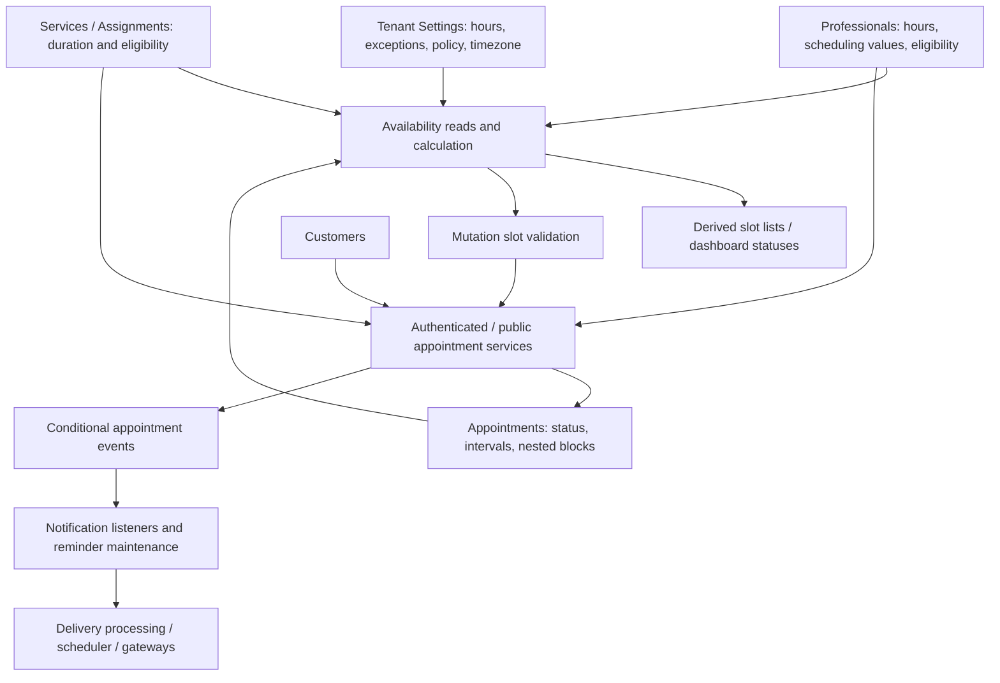

# Scheduling and booking

## Purpose and boundaries

Use this guide when changing scheduling configuration, availability answers or appointment creation/rescheduling/cancellation. The business behavior spans Tenant Settings, Professionals, Services/Assignments, Customers, Availability, Appointments and direct notification consumers.

This guide does not propose a Scheduling module, describe UI implementation or document notification/billing internals. Read [access control](access-control.md) for identity, membership and resource authorization, and [backend guidance](../AGENTS.md) for operations.

Documentation provides context; code and tests remain the evidence of actual behavior. Report inconsistencies, determine behavior from implementation/tests and update this guide when a task changes it. **Invariant** identifies an enforced constraint within a stated path; **Current behavior** does not imply approved permanent policy; **Uncertainty** marks intent or guarantees not established by the repository.

## Ownership and core relationships

| Concept | State owner / writer | Validation boundary today | Consumer and scope |
| --- | --- | --- | --- |
| Tenant recurring hours | Tenant Settings; onboarding also writes them | DTO/time conversion and transactional replacement; no located interval-order/overlap enforcement | Availability; tenant configuration |
| Professional recurring hours | Professionals; self/admin working-hours routes | Self resolves tenant/user professional; admin target lacks same-tenant validation; overlap validation is commented out | Availability; professional configuration |
| Timezone, buffer, booking policy | Tenant Settings; professional records also contain interval/advance values | Settings DTOs and persistence | Availability; tenant/professional configuration |
| Schedule exceptions | Tenant Settings exception service/repository | Date ordering and required intervals; supplied professional IDs lack located tenant validation | Availability; tenant-owned configuration with professional targeting |
| Exception blocks | Nested under schedule exceptions | Time conversion | Replacement local operating windows |
| Duration and service assignment | Services and professional assignment operations | Path-specific checks; Availability additionally checks active eligibility | Availability/Appointments; service configuration |
| Appointment intervals/status | Appointments | Mutation-specific availability and lifecycle checks | Availability; persisted booking state |
| Appointment blocks | Appointments, through nested mutation writes | Appointment mutation validation | Availability; appointment-owned UTC occupancy |
| Slots | No independent persisted owner | Calculated from current sources | Query output, not reservations |

Professional hours belong conceptually with Professionals; tenant hours with Tenant Settings. Consumption by Availability does not transfer ownership. Exceptions currently have tenant ownership even when targeting selected professionals. Appointment blocks belong to the booking lifecycle; they are not standalone professional time-off records.

Availability is a calculation/query domain and coordinating service. It reads state directly through Prisma-backed queries, but does not create/update the scheduling configuration. Shared scheduling utilities provide conversions; they do not own state either.

## Enforced invariants

- **Eligibility in active availability paths:** configuration loading requires tenant settings, an active/non-deleted service, and an active/non-deleted professional with an active assignment to that service in the requested tenant.
- **Scoped timeline:** Availability reads tenant/professional hours, applicable exceptions and appointments for the requested tenant/professional. Cancelled appointments are excluded.
- **Full closure:** an applicable closed exception rejects availability through the active calculation/validation paths.
- **Rescheduling exclusion:** authenticated rescheduling excludes the current appointment and its nested blocks from the scoped busy timeline, retaining other conflicts.
- **Appointment/block relationship:** creation writes a full-duration block; rescheduling replaces nested blocks along with appointment times.

These are path-specific constraints. They do not establish uniform listing/validation policy, correct isolation of every configuration write, or race-safe overlap prevention.

## Main flows and current behavior

### Configuration to derived availability

1. Load eligibility, service duration and scheduling settings.
2. Resolve professional interval/advance values over tenant settings. Professional fields currently have non-null defaults, so do not assume tenant settings govern every professional.
3. Read recurring hours, applicable exceptions and non-cancelled appointment intervals/blocks for the requested range.
4. Interpret dates in tenant timezone and select day-specific configuration.
5. Derive query output or validate a proposed mutation using the path's rules below.

**Current behavior:** any custom professional hours replace the entire tenant schedule. A missing day in a nonempty custom schedule means professional off; it does not fall back for that day. Without any custom hours, tenant hours apply. The active service does not intersect professional and tenant schedules despite generator comments suggesting intersection.

Applicable exceptions are tenant-wide when they have no professional links, or apply to linked professionals. Any full closure wins. For slot generation, non-closed exception blocks replace normal operating windows and multiple blocks are combined. The service first rejects days without base working hours, so exception intervals do not currently open an otherwise unscheduled day.

Hours/exception blocks are local minute ranges; appointments/appointment blocks are absolute instants. Availability uses the tenant timezone to combine them. Do not substitute server/browser timezone for tenant date semantics.

### Different availability answers

| Path | Hours/exceptions | Busy time and buffers | Booking limits / result |
| --- | --- | --- | --- |
| Day slots / overview | Base schedule, closures, replacement exception intervals | Appointment intervals plus blocks; extends existing busy ends by buffer | Minimum/maximum advance applied; free slots only |
| Dashboard appointment availability | Same base/closure/replacement calculation | Same busy inputs; supports excluding a scoped appointment | No advance-limit filter; busy/past/available statuses |
| Mutation `isSlotAvailable` | Base hours and closures; does not apply replacement exception intervals | Raw busy intervals; candidate end includes service duration plus buffer | Minimum notice/past checks depend on caller; no maximum-advance or slot-grid check |

Listing is an offer, not a reservation or proof the mutation validator will accept the slot. The separate generator `validateSlot` method is not called by the active mutation path; its rules must not be used to describe booking enforcement.

**Current behavior:** dashboard `hasAvailability` counts any non-busy slot, including past slots. `FULLY_BOOKED` in other results can reflect filtering by advance limits rather than actual occupancy alone.

### Appointment mutations

| Operation | Authenticated | Public/token-based |
| --- | --- | --- |
| Create | Optional customer; PENDING; ignores minimum notice and allows past booking | Finds/creates/updates customer first; CONFIRMED; normal minimum notice |
| Reschedule | Tenant-scoped lookup; rejects COMPLETED/CANCELLED; future changed start; own/others authorization; excludes original appointment | Token lookup; CONFIRMED only; at most one reschedule; normal minimum notice; does not exclude original appointment |
| Cancel | Rejects COMPLETED; already-cancelled returns existing response; removes blocks | CONFIRMED only; repeated cancellation rejected; blocks retained |
| Events | Create/reschedule/cancel emitted only when a customer is present | Creation emitted; reschedule/cancel have no matching emissions |

Creation resolves the tenant professional/service relationship, validates eligibility/availability and writes appointment snapshots plus one full-duration block. Staff can create customerless appointments; these paths do not emit the notification events described below.

Rescheduling uses the service's current duration to calculate the new end, replaces blocks and increments the count. Stored appointment duration is not updated in those writes. Public rescheduling can conflict with its own original interval when the new duration overlaps it.

Public cancellation retains blocks, but the active timeline filters out their cancelled parent appointment. Authenticated cancellation deletes blocks. Do not infer equivalent cleanup just because both stop occupying slots in this query.

### Transactions and overlap limits

Public creation wraps appointment persistence in a Prisma transaction, but customer writes happen before it and Availability reads do not receive its transaction client. Failed booking can therefore leave a customer created/updated. Authenticated creation and rescheduling validate before their repository writes without a shared validation/write transaction.

**Uncertainty:** no booking lock, exclusion constraint or serializable protocol was located in the inspected code/migrations. A transaction wrapper or repository comment about atomic verification does not establish race-safe collision prevention. Actual deployed database constraints were not inspected. Slots can change between query, validation and persistence.

## Authorization and tenant isolation

Authenticated appointment mutations use guard-derived tenant context and tenant-scoped target lookups. Rescheduling additionally checks the professional/user relationship unless the caller has reschedule-others permission. Read/create do not enforce an equivalent own-professional rule; see [access control](access-control.md).

Public booking accepts a tenant/resource combination and relies on service/Availability eligibility checks. Management operations derive tenant/professional/service from the token-resolved appointment. Management tokens are capabilities; do not treat them as harmless confirmation labels.

Availability's authenticated appointment-query route uses guard tenant context, while slots/overview/validate accept query tenant IDs separately. Configuration ownership and foreign keys do not themselves prove every write's related records belong to the same tenant.

## Dependencies and events / side effects

This is a conceptual feedback loop through persisted appointment state, not a Nest import cycle: Availability does not import AppointmentsModule. Its direct reads couple calculation to other owners' persistence shape.

| Event consumer | Direct consequence |
| --- | --- |
| Created listener | Public-created appointment can notify the linked professional user; staff-created appointment can notify the customer. Schedules customer reminders 24h/2h before the appointment when those times remain future |
| Rescheduled listener | Cancels pending reminder deliveries, creates customer reschedule notification and schedules replacement reminders |
| Cancelled listener | Cancels pending reminders and notifies the opposite recipient according to who cancelled |

Listeners are asynchronous and persistence uses `emit`, not an awaited atomic notification transaction. Notifications create persisted deliveries; immediate processing events and the scheduler continue into configured gateways. Event emission is not proof of successful delivery or exactly-once behavior. Public reschedule/cancel currently bypass the event-driven reminder maintenance path.

## Edge cases, inconsistencies and uncertainties

| Finding | Current behavior / uncertainty |
| --- | --- |
| Exception listing versus validation | Generation replaces operating windows; mutation checks base hours. A displayed slot can be rejected, or an unlisted base-hours time accepted |
| Buffer placement differs | Generation extends existing busy ends; mutation extends candidate end, including its closing-hours check |
| Maximum advance / slot grid | Generated free slots apply advance limits and an interval grid; mutation validation does not enforce maximum advance or grid alignment |
| Tenant defaults versus professional values | Non-null professional defaults override tenant policy values; intended inheritance is unclear |
| Configuration validation | Interval ordering/overlap enforcement is absent in inspected hours paths; administrative professional replacement does not start its own transaction; same-tenant related-ID checks are incomplete |
| Global exception representation | Query supports exceptions with no professional links, but create/update DTOs require a nonempty list |
| Persisted settings versus booking enforcement | Cancellation window, pending-booking cap, confirmation requirement, holiday auto-apply and passive-time setting are not enforced by the inspected appointment mutations |
| Customer eligibility | Booking paths do not check customer blocking; public lookup by phone can update existing customer data before booking validation |
| Occupancy meaning | All non-cancelled appointment statuses contribute busy time. Full appointment intervals plus full-duration blocks are redundant today; passive-time intent is unestablished |
| Snapshot duration | Rescheduling uses current service duration without updating stored appointment duration |
| Time boundaries | Overnight intervals, DST transitions and exception date-boundary intent are not covered by located tests; mutation's local-minute containment must not be presented as proven cross-midnight correctness |
| Legacy availability path | Shared `AvailabilityQuery` is registered/exported but no consumer was located; it differs from active repository/service behavior |
| Incomplete integration | Public-web booking mutations remain placeholders; emitted management URLs have no established matching web pages in the earlier cross-app investigation |

Do not resolve these discrepancies in prose or make a new business-policy decision. Recheck relevant paths when changing behavior and report which inconsistency remains.

There is an implicit scheduling vocabulary and policy, but current evidence does not require a new state-owning Scheduling module. Extracting shared policy might eventually reduce duplicated calculations; moving configuration/blocks would also add dependencies for professional identity, onboarding and appointment transactions. Document ownership before considering structural work.

## Implementation entry points and test coverage

| Question | Verify |
| --- | --- |
| Authored ownership and relationships | [Schema](../prisma/schema.prisma), [migrations](../prisma/migrations) |
| Tenant configuration and exceptions | [Tenant Settings](../src/modules/tenants/features/settings), [onboarding schedule writes](../src/modules/tenants/features/onboarding/onboarding.service.ts) |
| Professional configuration | [Working hours](../src/modules/professionals/features/working-hours), [professional repository](../src/modules/professionals/professionals.repository.ts) |
| Service/customer relationships | [Services](../src/modules/services), [Customers](../src/modules/customers) |
| Active calculation and routes | [Availability service](../src/modules/availability/availability.service.ts), [repository](../src/modules/availability/availability.repository.ts), [generator](../src/modules/availability/slots-generator.ts), [controller](../src/modules/availability/availability.controller.ts) |
| Mutation and token flows | [Authenticated service](../src/modules/appointments/appointments.service.ts), [public service](../src/modules/appointments/appointments-public.service.ts), [repositories/events/mapper](../src/modules/appointments), [Public facade](../src/modules/public) |
| Direct effects | [Appointment listeners](../src/modules/notifications/listeners/appointments), [notification service](../src/modules/notifications/application/services/notifications.service.ts), [delivery repository](../src/modules/notifications/infraestructure/repositories/notification-delivery.repository.ts), [scheduler](../src/modules/notifications/schedulers/notification-scheduler.service.ts) |
| Alternative/shared calculations | [Shared scheduling utilities](../src/shared/schedule), [shared availability query](../src/shared/infrastructure/queries/availability.query.ts) |

[Availability tests](../src/modules/availability/availability.service.spec.ts) cover excluding the original appointment/blocks, retaining other conflicts, unchanged creation availability and an unrelated excluded ID. [Schedule utility tests](../src/shared/schedule/schedule.utils.spec.ts) cover format conversions. They do not establish mutation concurrency, guard security, exception/buffer parity, public lifecycle/event correctness or DST handling.

Generated Prisma files with suffixes such as ` 2.ts` are not independent evidence of domain models. Use the authored schema, migration history and actual code/tests; normal application imports use unsuffixed generated paths. Cleanup/regeneration is separate work, and the duplicate files' tooling impact is not settled by this guide.

## When to update this document

Update when changing hours ownership/fallback, exception precedence/targeting, eligibility, timezone/date semantics, buffers/limits, occupancy representation, appointment statuses/snapshots, mutation authorization, transaction guarantees or event emission. Reverify query and mutation paths together, including customerless and public behavior. Keep implementation catalogs in code, operations in AGENTS.md/skills and integration coordination in the parent cross-app workflow when available.
